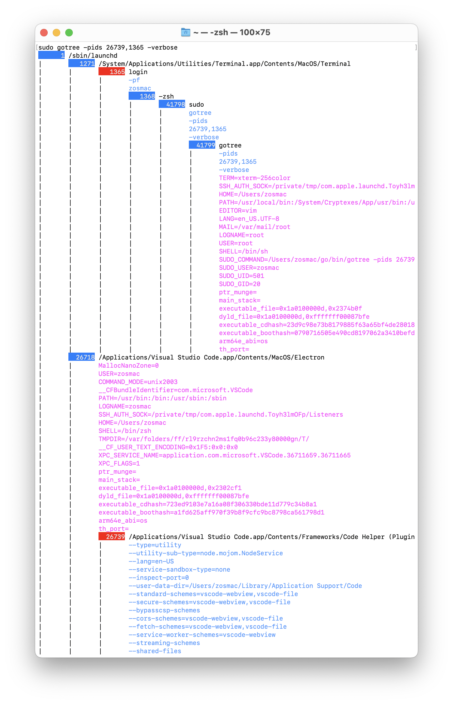

# Welcome to *GoTree*: *Go* language based process *Tree* listing

## Overview

The `gotree` command prints a tree listing of the processes on the system. The tree organizes the processes by parent/child relationships and lists the processes with the deepest descendants first. Each process in the listing shows the pid and the command name.

The `gotree` command accepts the following optional flags:

* `-verbose`: expands the listing of each process to include the full command path, arguments, and environment variables.
* `-pids`: limits the listing to just the branches that include processes specified by a comma separated list of pids.

## Example

## Notices

Copyright © 2023 The Gomon Project.
